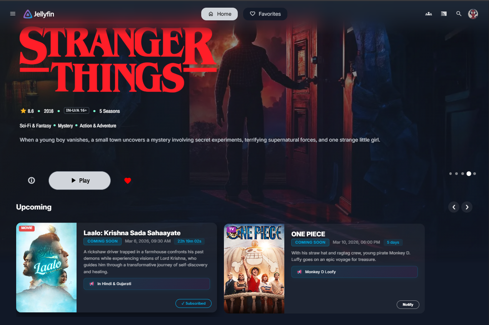
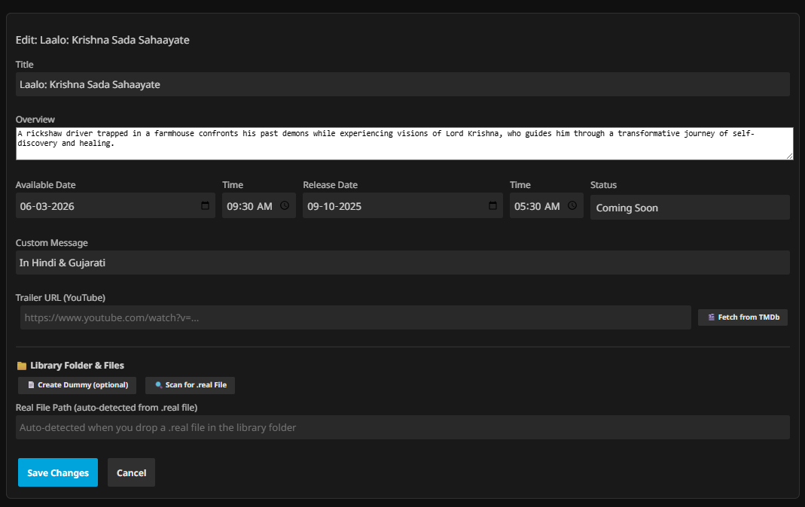
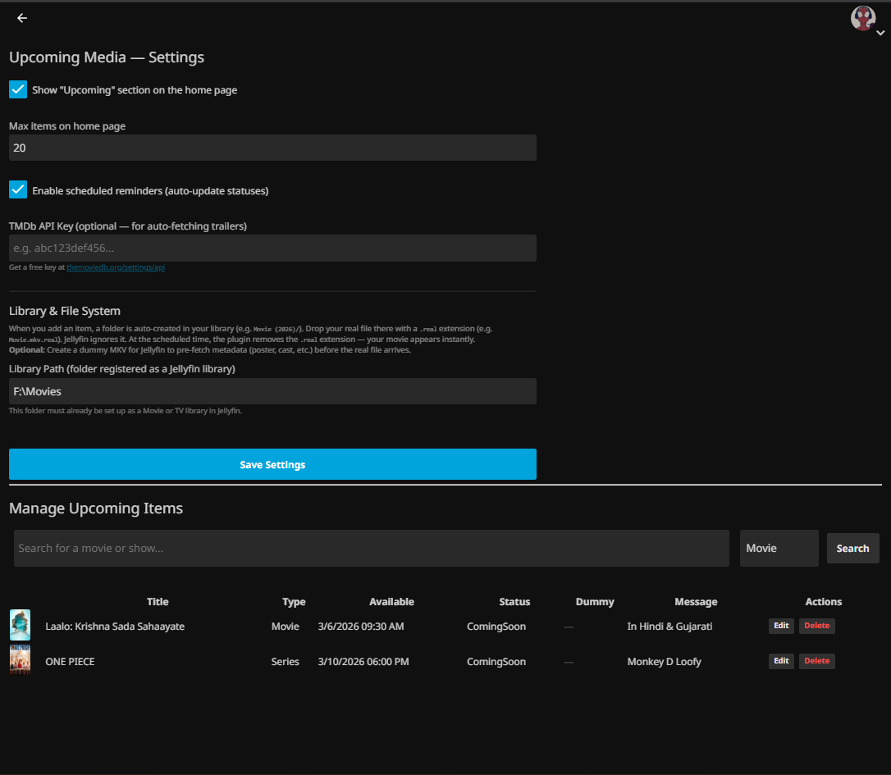

<h1 align="center">Upcoming Media — Jellyfin Plugin</h1>

<p align="center">
  Display <strong>upcoming movies &amp; TV shows</strong> directly on your Jellyfin home page.<br/>
  Search TMDb, set release dates, and curate a "Coming Soon" experience for all your users.
</p>

---

## Screenshots

### Home Page Widget
> An "Upcoming" section is injected right on the Jellyfin home page for all users.

<p align="center">
  
</p>

### Plugin Configuration
> Admins can add, edit, and manage upcoming items — search TMDb, set dates, manage files.

<p align="center">
  
</p>

### Plugin Dashboard
> View the plugin in the Jellyfin Plugins dashboard.

<p align="center">
  
</p>

---

## Features

- **Home Page Widget** — Shows an "Upcoming" section with posters, countdowns, and trailers on every user's home page
- **TMDb Integration** — Search movies & TV shows and auto-fill metadata (poster, backdrop, overview, genres, trailer)
- **Status Lifecycle** — Automatic transitions: *Coming Soon* → *Available* → *Expired* based on dates you set
- **Library Folder System** — Auto-creates folders in your media library; drop a `.real` file and it activates on the release date
- **Dummy File Support** — Optional placeholder MKV so Jellyfin indexes the folder before the real media is available
- **Scheduled Task** — Background task checks dates, updates statuses, and auto-swaps files
- **Notification Subscriptions** — Users can subscribe to get notified when items become available
- **YouTube Trailers** — Fetches trailer links from TMDb for inline playback on the home widget

---

## Installation

### Plugin Repository (Recommended)

1. In Jellyfin, go to **Dashboard** → **Plugins** → **Repositories**
2. Click **Add** and enter:
   - **Name:** `Upcoming Media`
   - **URL:**
     ```
     https://raw.githubusercontent.com/Codesickm/jellyfin-plugin-upcoming-media/main/manifest.json
     ```
3. Click **Save**
4. Go to **Plugins** → **Catalog**, find **Upcoming Media**, and click **Install**
5. Restart Jellyfin

### Manual Install

1. Download the ZIP from the [latest release](../../releases/latest)
2. Extract `JellyfinUpcomingMedia.dll` into your Jellyfin plugin directory:
   - **Windows:** `%LocalAppData%\Jellyfin\plugins\Upcoming Media_1.0.0.0\`
   - **Linux:** `~/.local/share/jellyfin/plugins/Upcoming Media_1.0.0.0/`
   - **Docker:** `/config/plugins/Upcoming Media_1.0.0.0/`
3. Restart Jellyfin

---

## Configuration

1. Go to **Dashboard → Plugins → Upcoming Media → Settings**
2. Enter your **TMDb API Key** (get one free at [themoviedb.org](https://www.themoviedb.org/settings/api))
3. Set your **Library Path** (where media folders will be auto-created)
4. Add items manually or search TMDb
5. Set **Available Dates** — the plugin handles the rest automatically

### How the File Swap System Works

1. **Add an item** → A folder is auto-created in your library (e.g., `Movies/Movie Name (2026)/`)
2. **Drop your media file** with a `.real` extension into that folder (e.g., `movie.mkv.real`)
3. **On the release date** (or click "Activate Now") → the `.real` extension is removed and Jellyfin picks it up on the next scan

---

## Requirements

- **Jellyfin Server** 10.11.x+
- **TMDb API Key** (free) for metadata search

## Contributing

Contributions are welcome! Feel free to open issues or submit pull requests.

## License

This project is licensed under the [MIT License](LICENSE).

---

<p align="center">
  Made with ❤️ for the Jellyfin community
</p>
</p>
